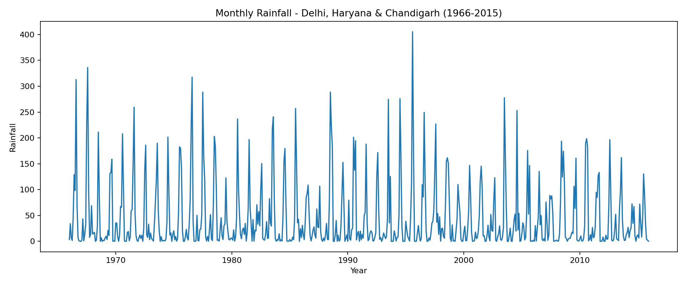
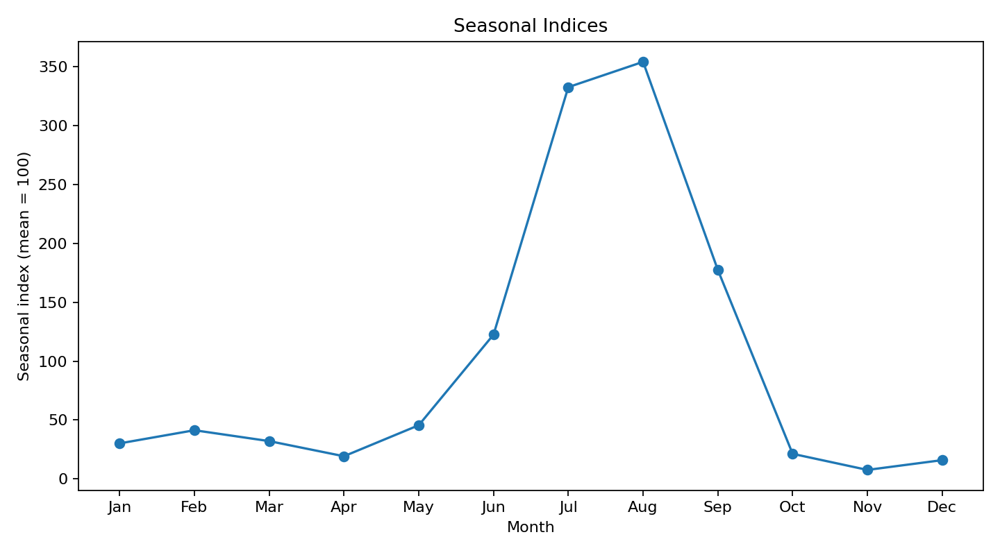
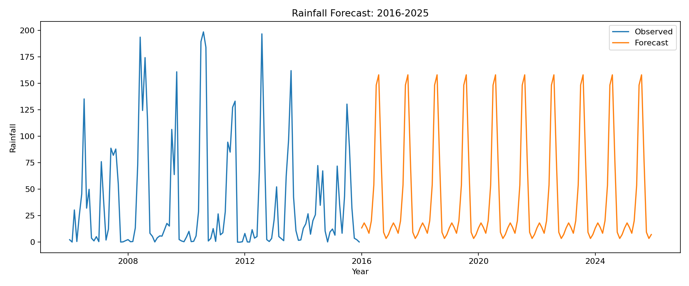

# Rainfall Time Series Analysis

A reproducible Python reconstruction of an academic time-series project on rainfall patterns in India.

## Project scope

The original academic report compares:

- **Delhi, Haryana & Chandigarh**
- **Assam & Meghalaya**

The project studies the four classical components of a time series — **trend, seasonal, cyclic, and random** — and then compares forecasting models to project rainfall patterns through 2025.

> The original report contains both regional analyses. The raw monthly dataset currently available in this repository is only for **Delhi, Haryana & Chandigarh**, so the Python reconstruction is limited to that region rather than inventing the missing Assam-Meghalaya data.

## Dataset

The supplied raw file contains **600 monthly observations from January 1966 to December 2015**.

- Raw data: [data/raw/delhi_haryana_chandigarh_source.csv](data/raw/delhi_haryana_chandigarh_source.csv)
- Original academic report: [report/original_academic_report.pdf](report/original_academic_report.pdf)

One rainfall cell, **November 1970**, is blank in the supplied CSV. The Python reconstruction treats it as `0.0`, which reproduces the annual average reported in the original academic work.

## Python implementation

The complete analysis is in:

[src/rainfall_time_series_analysis.py](src/rainfall_time_series_analysis.py)

It performs:

1. Data cleaning and monthly-date parsing
2. Monthly time-series visualization
3. Annual-average linear trend estimation
4. Multiplicative decomposition
5. Seasonal-index estimation and deseasonalization
6. Harmonic analysis using 20 trial periods
7. Cyclic and random component estimation
8. Variate-difference calculations
9. Augmented Dickey-Fuller stationarity test
10. ACF/PACF diagnostics
11. Model comparison:
   - Simple Seasonal exponential smoothing
   - SARIMA(0,0,0)(0,1,1)[12]
   - ARIMA(2,0,2)
12. Forecasting from 2016 through 2025

## Time-series pattern



The monthly series shows strong recurring monsoon-season peaks.

## Seasonal component



The seasonal component is dominant, with the highest indices in **July and August**, consistent with the original project's conclusion that rainfall in this region is concentrated in a few monsoon months.

## Stationarity check

Using an Augmented Dickey-Fuller test with lag 8 and a trend term:

- ADF statistic: approximately **-17.806**
- Conclusion: the series is stationary at the 5% significance level

This closely reproduces the stationarity result reported in the academic report.

## Model comparison

| Model | R² | RMSE | MAE |
|---|---:|---:|---:|
| **Simple Seasonal** | **0.658** | **38.166** | **22.816** |
| SARIMA(0,0,0)(0,1,1)[12] | 0.616 | 40.084 | 24.086 |
| ARIMA(2,0,2) | 0.330 | 53.398 | 36.851 |

Among these three models, the **Simple Seasonal model** gives the lowest RMSE and MAE, matching the original report's selection for Delhi/Haryana/Chandigarh.

## Forecast: 2016-2025



The forecast retains the strong yearly seasonal pattern present in the historical series.

## Other reproducibility checks

The Python reconstruction also reproduces or closely matches several values from the original project:

- Maximum recorded rainfall: **405.3**
- Strongest harmonic trial period: approximately **100 months (8.33 years)**
- Dominant seasonal peaks: **July-August**
- Simple Seasonal model selected as the best of the three compared models

Machine-readable outputs are available in the [results](results/) folder.

## Run locally

```bash
pip install -r requirements.txt
python src/rainfall_time_series_analysis.py
```

The script generates processed datasets, statistical results, and plots automatically.

## Repository structure

```text
rainfall-time-series-analysis/
├── README.md
├── src/
│   └── rainfall_time_series_analysis.py
├── data/
│   └── raw/
│       └── delhi_haryana_chandigarh_source.csv
├── results/
├── figures/
├── report/
│   └── original_academic_report.pdf
├── requirements.txt
└── .gitignore
```

## Tools

Python · Pandas · NumPy · Matplotlib · SciPy · Statsmodels · Scikit-learn · Time Series Analysis · ADF · ACF/PACF · ARIMA · SARIMA · Exponential Smoothing
